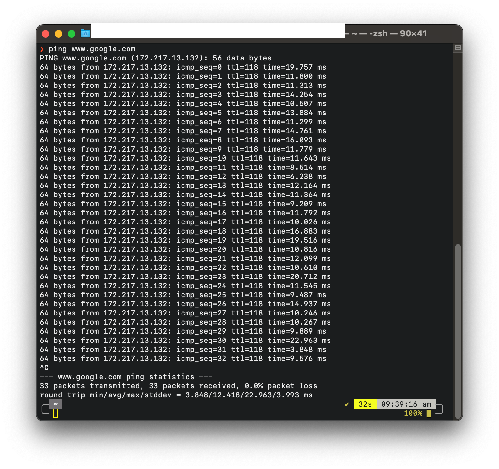

Did you know that you can use your Terminal to ping a web address?

<p align="center">
  
</p>

## How to ping a URL or an address?

It is as simple as 

```
ping {www.domain.tld}
```

for example you could try with google.com
```
ping www.google.com
```

In my case I am using a Mac, on my Terminal & for `www.google.com` domain

## Why pinging an URL?

Just for fun 
To understand how Internet works
